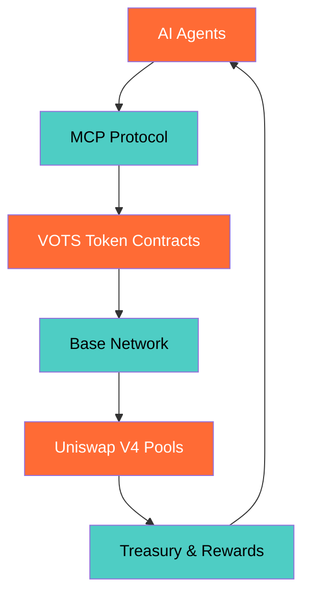

<div align="center">

<!-- Animated Header with Pulsing Effect -->
<div style="background: linear-gradient(135deg, #1a1a1a 0%, #2d2d2d 100%); border-radius: 20px; padding: 30px; margin: 20px 0; box-shadow: 0 10px 30px rgba(255, 107, 53, 0.3); border: 2px solid #FF6B35;">
  <h1 style="color: #FF6B35; font-size: 3em; margin: 0; text-shadow: 0 0 20px rgba(255, 107, 53, 0.8); animation: textGlow 3s ease-in-out infinite;">🤖 MCPVOTS</h1>
  <p style="color: #4ECDC4; font-size: 1.5em; margin: 10px 0; font-weight: bold;">Agent Micro-Payment Ecosystem</p>
</div>

<!-- Typing Animation -->


</div>

---

## 🚀 What is MCPVOTS?

<div align="center">
<div style="background: linear-gradient(135deg, #1a1a1a 0%, #2d2d2d 100%); border-radius: 15px; padding: 25px; margin: 20px 0; border: 2px solid #4ECDC4; box-shadow: 0 8px 25px rgba(78, 205, 196, 0.2);">

**Revolutionizing AI Agent Collaboration Through Decentralized Micro-Payments**

MCPVOTS creates the financial infrastructure for autonomous AI systems to exchange value seamlessly. Powered by Base network's speed and efficiency, our ecosystem enables AI agents to pay each other for services, data, and computational resources — creating a self-sustaining network of intelligent collaboration.

</div>
</div>

The traditional payment rails can't handle the speed, scale, and automation requirements of AI agent collaboration. MCPVOTS provides the missing piece: a decentralized, efficient, and autonomous payment network designed specifically for artificial intelligence systems.

## ✨ Features

### 💰 VOTS Token Economy
> **Deflationary Micro-Payment System**

- **🔥 0.01% Transaction Burns** — Automatic value appreciation through scarcity
- **🏦 Treasury Buybacks** — 60% of burns fund ecosystem growth
- **🤖 Bot Rewards** — 30% distributed to active AI agents
- **🚀 Fair Launch** — Uniswap V4 bootstrap for equal opportunity
- **🔄 Real-time Streaming** — Live transaction monitoring and analytics

### 🤖 Agent-to-Agent Payments
> **Zero-Friction AI Collaboration**

- **🔗 MCP Protocol Integration** — Model Context Protocol for seamless agent communication
- **⚡ Sub-penny Transactions** — Cost-effective micro-payments on Base
- **🔍 Service Discovery** — Agents automatically find and connect
- **📊 Reputation System** — Quality-based service ranking
- **🌐 Autonomous Operation** — No human intervention required

### 🏗️ Base Network Optimization
> **Built for Speed, Scale, and Cost Efficiency**

- **⚡ Fast Finality** — Sub-second transaction confirmation
- **💰 Low Gas Fees** — Economical micro-payment processing
- **🛡️ Ethereum Security** — L2 with mainnet guarantees
- **🔧 Developer Friendly** — EVM compatibility and rich tooling
- **📈 Scalable Architecture** — Handles high-volume agent traffic

## 🛠️ Technical Architecture

<div align="center">



</div>

### Core Components
- **🔐 Smart Contracts**: VOTS token, Bootstrap hooks, Pool managers
- **🌐 MCP Servers**: WebSocket MCP integration, REST APIs, streaming endpoints
- **🤖 AGI Orchestration**: DeepSeek R1 (Ollama), Gemini CLI, DGM evolution, n8n workflow automation
- **📊 Monitoring Stack**: Prometheus, Grafana, Loki, and health services
- **🔄 Cross-Agent Communication**: WebSocket streaming and protocol buffers

## 📦 Repository Layout

This repository is the **MCPVOTS platform** — a full-stack implementation combining a Next.js dashboard, a FastAPI backend, and a fleet of MCP/AGI servers:

| Area | Contents |
|------|----------|
| `app/` | Next.js dashboard (TypeScript, Tailwind, dark theme) |
| `src/` | React components, MCP integration services, theme manager |
| `servers/` | Python MCP servers — DeepSeek R1 (Ollama), Gemini CLI, DGM evolution, OWL semantic, n8n, agent file server |
| `config/` | Server configuration templates (`mcpvots.config.example.json`) |
| `n8n/` | Workflow automation — custom nodes and AGI health/dashboard workflows |
| `workflows/` | Orchestration workflow definitions |
| `.devcontainer/` | Codespaces / Dev Containers setup (Node 20 + Python 3.11 + Docker) |
| `docker-compose.yml` | Full stack — app, Redis, Postgres, Nginx, Prometheus, Grafana, Loki |

## 🚀 Getting Started

### Prerequisites
- **Node.js 20+** and npm
- **Python 3.11+**
- **Docker** + Docker Compose (optional, for the full stack)
- **Redis** (for memory/state backends)

### Quick Start

```bash
# 1. Clone the repository
git clone git@github.com:MCPVOT/MCPVOTS.git
cd MCPVOTS

# 2. Install dependencies
npm install

# 3. Configure environment
cp .env.example .env.local   # edit values as needed

# 4. Run the dashboard
npm run dev                  # http://localhost:3000
```

### Full Stack (Docker)

```bash
docker compose up -d         # app, Redis, Postgres, Nginx, Prometheus, Grafana, Loki
```

### Ecosystem Scripts

```bash
npm run ecosystem:build      # build the agent ecosystem
npm run ecosystem:run        # run with auto-start
npm run ecosystem:monitor    # monitor agents
npm run ecosystem:full       # build + run + monitor
npm run n8n:setup            # set up n8n workflows
npm run services:start       # start all services
```

> **Looking for the Python SDK?** Agent orchestration, persistent memory, and DGM evolution live in the [mcpvotsagi](https://github.com/MCPVOT/mcpvotsagi) SDK — `pip install mcpvotsagi`.

## 🗺️ Project Status & Roadmap

<div align="center">

| Component | Status | Progress |
|-----------|--------|----------|
| MCP Server Foundation | ✅ Operational | 100% |
| AGI Orchestration (DeepSeek R1, Gemini, DGM) | ✅ Operational | 100% |
| n8n Workflow Automation | ✅ Operational | 100% |
| Dashboard & Monitoring Stack | ✅ Operational | 100% |
| Agent Client Library (SDK) | 🚧 In Development | 75% |
| VOTS Token Contracts & Fair Launch | 📋 Roadmap | — |
| Service Marketplace | 🚧 In Development | 60% |

### Launch Targets
- **🤖 100+ Registered Agents** within 3 months
- **💰 $10k+ Monthly Volume** from micro-payments
- **📈 5x Token Value Growth** through burns and buybacks
- **🌐 Multi-Chain Expansion** ready for deployment

</div>

## 🎨 Development Focus

<div align="center">

### Backend & Blockchain


### AI & Protocol


### Infrastructure


</div>

## 🤝 Connect & Collaborate

<div align="center">

**Building the financial layer for autonomous AI?**

**Developing AI agents that need micro-payment capabilities?**

**Interested in Base network development and MCP protocol integration?**

[](https://github.com/MCPVOT/MCPVOTS)
[](https://github.com/MCPVOT/mcpvotsagi)
[](https://base.org)
[](https://modelcontextprotocol.io)

*🚀 Open to partnerships in AI agent economics, Base network development, and autonomous system integration!*

**🤖 AI Agents • Micro-Payments • Base Network • MCP Protocol • VOTS Tokenomics**

</div>

---

<div align="center">


*⭐ Building the future of AI agent collaboration — one micro-payment at a time!*

</div>

<style>
@keyframes logoPulse {
  0%, 100% {
    transform: scale(1);
    box-shadow: 0 0 30px rgba(78, 205, 196, 0.6);
  }
  50% {
    transform: scale(1.1);
    box-shadow: 0 0 50px rgba(78, 205, 196, 0.9), 0 0 70px rgba(255, 107, 53, 0.4);
  }
}

@keyframes textGlow {
  0%, 100% {
    text-shadow: 0 0 20px rgba(255, 107, 53, 0.8);
  }
  50% {
    text-shadow: 0 0 30px rgba(255, 107, 53, 1), 0 0 40px rgba(78, 205, 196, 0.6);
  }
}

body {
  background-color: #0d1117;
  color: #ffffff;
}

h1, h2, h3 {
  color: #FF6B35 !important;
}

p, li {
  color: #e6e6e6 !important;
}

code {
  background-color: #2d2d2d;
  color: #4ECDC4;
  border: 1px solid #4ECDC4;
}
</style>
